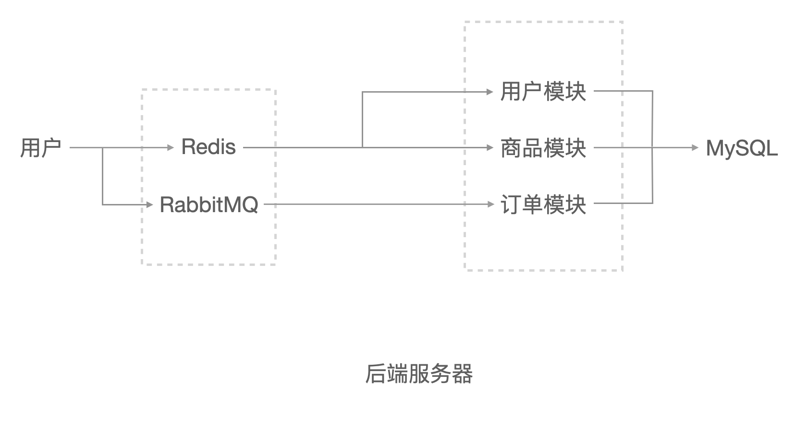
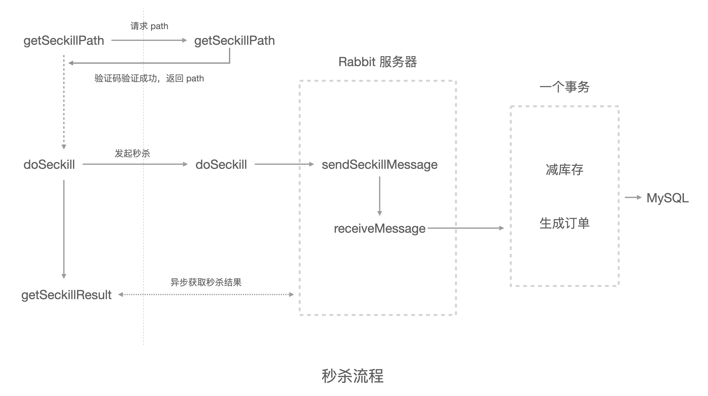

高并发商城秒杀项目

- [项目简介](#项目简介)
- [项目架构](#项目架构)
- [项目详细介绍](#项目详细介绍)
- [项目总结](#项目总结)
- [参考项目](#参考项目)

## 项目简介

本系统是在学习[《高并发商城秒杀项目》](https://www.bilibili.com/video/BV1Ha4y1e7Uj?p=43&spm_id_from=333.1007.top_right_bar_window_history.content.click
)时实现的，主要实现了电商系统的「秒杀」环节。秒杀属于一种**高并发**的场景，其并发瓶颈主要体现在对 MySQL 数据库的访问。因此本项目主要是使用缓存、消息队列等技术，优化系统对数据库的访问，从而提高系统并发量。

- 开发环境：

|                           ☕                            |                            🌁                            |                        🏖                                                                            |                       🦄                       |
|:------------------------------------------------------:|:--------------------------------------------------------:|:----------------------------------------------------------------------------------------------------:|:----------------------------------------------:|
|          [`Java 1.8`](https://www.java.com/)           | [`Mysql 8.0.28`](https://dev.mysql.com/downloads/mysql/) | [`Redis 4.0.1`](https://github.com/zaiyunduan123/Java-Interview/blob/master/notes/database/Redis.md) | [`RabbitMQ 3.9.13`](https://www.rabbitmq.com/) |

## 项目架构

## 项目详细介绍

### 缓存技术

使用到的缓存技术主要有：

- 页面缓存。对于实时性要求不是很高的页面，可以将其缓存起来，比如商品列表页，缓存对象是 HTML 页面代码。对于客户端的每次请求，都先去缓存看下有没有数据，如果有就直接返回，如果没有再去访问数据库。并且设置一定的到期时间，过期后重新访问数据库获取最新数据。

- URL 缓存。和页面缓存差不多，区别是比页面缓存的力度要稍微小一点。页面缓存对于不同的访问对象，返回的页面都是一样的。而 URL 缓存，对于不同的访问对象，返回的页面可能是不一样的。比如，商品详情页，每个商品的页面都是不同的。

- 对象缓存。是最细粒度的缓存，比如缓存用户的 Token。并且对象缓存一般不设置过期时间，保持永久有效。但是当你更新了数据库以后，一定要记得修改对应的缓存。

缓存力度从大到小排序：页面缓存 > URL 缓存 > 对象缓存

### 页面静态化，前后端分离

如果做了页面缓存的话，客服端还是需要去访问服务器获取数据。我们可以将页面直接缓存在客户端，这样就不用每次都需要访问服务器获取数据了。

### 消息队列

使用消息队列来异步下单。实现削峰填谷。

虽说使用缓存技术已经可以极大的提高系统并发量了，但是对于缓存的访问也是需要时间的。我们还可以做的更极致一点，将访问缓存的这点时间也省掉。

当有秒杀订单进来时，我们并不直接它去访问缓存，而是让他去消息队列中排队，异步下单。前端页面提交秒杀请求后，不断轮询后端秒杀结果。

### 秒杀流程

## 项目总结

本系统作为入门项目，可以很好的用来练手。但又因为是入门项目，所以还有很多可以改进的地方。

## 参考项目

[`dis-seckill`](https://github.com/parkt90/dis-seckill)
